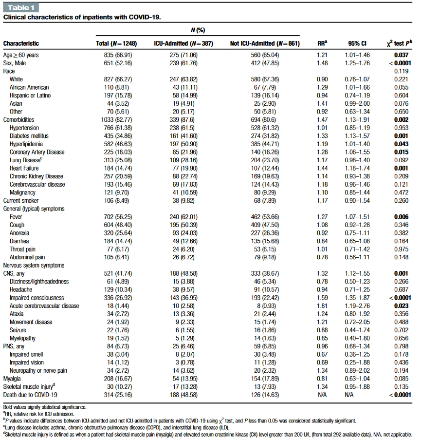
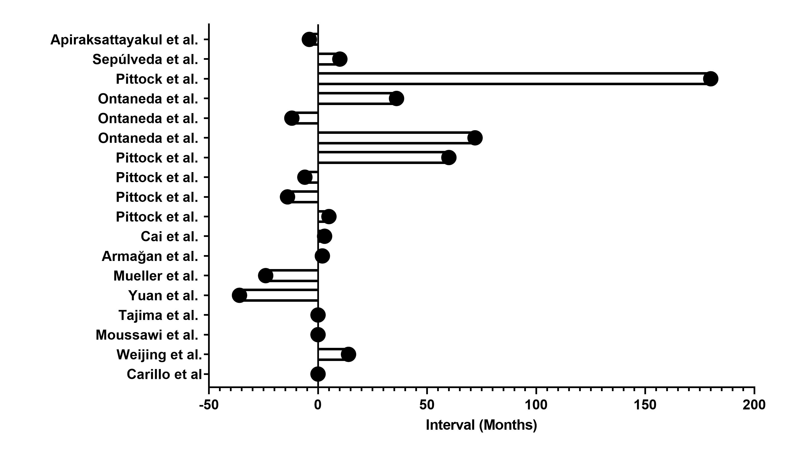

# **Bahadar Srichawla D.O., M.S.**
## Physician-Scientist
### Technical Skills: Python, RStudio, MATLAB

## 🔗 Links
[Google Scholar](https://scholar.google.com/citations?user=OYueD80AAAAJ)    [ResearchGate](https://www.researchgate.net/profile/Bahadar-Srichawla)

[PubMed](https://www.ncbi.nlm.nih.gov/myncbi/bahadar.srichawla.1/bibliography/public/?sortby=pubDate&sdirection=descending)  [Twitter](https://twitter.com/BSrichawlaDO)
  
[Linkedin](https://www.linkedin.com/in/bahadar/)  [Doximity](https://www.doximity.com/pub/bahadar-srichawla-do-6c4cf0da)

[ORCID](https://orcid.org/0000-0002-5301-4102)

## 🌟 Biography
Bahadar Srichawla is a current resident physician in the department of neurology at the University of Massachusetts Chan Medical School. His research interests are deeply rooted in the reurological sciences. And is particularly specialized in:

**Neurocritical Care:** Focusing on advanced treatments and interventions for critically ill neurological patients.

**Cerebral Hemodynamics:** Investigating the dynamics of blood flow in the brain and how it impacts neurological conditions.

**Multimodal Neuromonitoring:** Utilizing multiple forms of neurological monitoring to provide a comprehensive understanding of a patient's neurophysiological state.

**Data Science & Machine Learning in ICU:** Leveraging data science and machine learning techniques to advance our understanding of cerebral physiology. The aim is to employ these technologies to improve the clinical care of patients in the intensive care unit.

## 🎓 Education
**Residency**, _Neurology_, University of Massachusetts Chan Medical School (2022-2025)

 **Internship**, _Medicine_, University of Massachusetts Chan Medical School (2021-2022)
 
 **Doctor of Osteopathic Medicine (D.O.)**, _Medicine_, Touro College (2017-2021)
 
 **Graduate Certificate**, _Clinical Research_,  Harvard University (2017-2019)
 
 **Master of Science (M.S.)**, _Biophysics_, Stony Brook University (2016-2017)
 
 **Bachelor of Science (B.S.)**, _Neuroscience_, Stony Brook University (2012-2016)
  
## 🛠 Selected Experience
**Resident Physician** @ UMass Memorial Medical Center (2021-2025)

**Research Associate** @ Stony Brook University (2015-2017)
  - Solomon Lab: Understanding the mechanisms by which central nervous system (CNS) neurons integrate peripheral and central inputs in respiratory and cardiovascular control.
  - Competency in multi-channel electrode array electromyography (EMG) in both mice and rats. 
  - Complex physiological data analysis using MATLAB.

## 🔬 Clinical Trials
**Sub-Investigator** @ Univeristy of Massachusetts Chan Medical School (2022- )
  - [BOOST-3 Clinical Trial](https://clinicaltrials.gov/study/NCT03754114)
  - [FASTEST Phase III Clinical Trial](https://classic.clinicaltrials.gov/ct2/show/NCT03496883)
  - [MOST Phase III Clinical Trial](https://classic.clinicaltrials.gov/ct2/show/NCT03735979)
    
## 📈 Selected Projects
## Neurological Manifestations, ICU outcomes, and Biomarkers in COVID-19
[Publication 1](https://journals.lww.com/annals-of-medicine-and-surgery/fulltext/2023/07000/a_single_center_retrospective_study_of.13.aspx)

[Publication 2](https://journals.sagepub.com/doi/abs/10.1177/10815589231191813)
  
This project investigates the clinical, neurological, and laboratory markers in hospitalized COVID-19 patients based on a retrospective study of 1248 inpatients. A multivariate logistic regression analysis was completed using SAS. Key findings reveal that 31% of patients were admitted to the ICU, with a higher prevalence of male and older individuals. Neurological symptoms were observed in 41.74% of the cases, affecting the central nervous system. A mortality rate of 25.16% was noted, significantly higher among ICU-admitted patients. Elevated levels of specific biomarkers like white blood cell count, ferritin, and lactate dehydrogenase were associated with ICU admission. The study underscores the importance of these markers in predicting morbidity, ICU admission, and mortality, offering valuable insights for effective COVID-19 management.

A subroup analysis of 387 patients admitted to the ICU was conducted. Nearly half (48.5%) of the ICU patients succumbed to COVID-19. Factors that contributed to increased mortality included being 60 years of age or older, impaired consciousness, lung disease, elevated international normalized ratio (INR) and elevated blood urea nitrogen (BUN) levels. Surprisingly, symptoms such as dizziness/lightheadedness, myalgia, and headache were associated with a higher likelihood of survival. Additionally, elevated D-dimer and aspartate aminotransferase (AST) levels, as well as lymphopenia, were more commonly observed in deceased patients.

## Meta Analysis: Neuromyelitis Optica Spectrum Disorder (NMOSD) and Breast Cancer
[Publication](https://pubmed.ncbi.nlm.nih.gov/37453952/)

This project focuses on the relationship between neuromyelitis optica spectrum disorder (NMOSD) and breast cancer. NMOSD is an autoimmune astrocytopathy marked by neuroinflammation and demyelination in the central nervous system, often mediated by aquaporin-4 immunoglobulin (AQP4-IgG). The meta-anlysis was completed using Python, and data visualization was completed using GraphPad Prism. Based on a systematic review and meta-analysis of 12 publications, we identified 19 cases, all in women, with an average age of 51.26 years. Neurological symptoms like speech abnormalities and myelopathy were commonly observed, and MRI scans often showed longitudinally extensive transverse myelitis involving the cervical spine. Our data reveals a complex temporal relationship between NMOSD and breast cancer diagnosis: 15.9% were diagnosed with both conditions within the same month, 26.1% had prior breast cancer diagnosis, and 42.1% were diagnosed with breast cancer following NMOSD. Given the broad time range for breast cancer diagnosis relative to NMOSD onset, our study suggests that older women newly diagnosed with NMOSD should undergo frequent breast cancer screening.

## 📚 Bibliography 
1.	Purwar S., Fatima A., Bhattacharyya, H., Kutikuppala, L.V.S., Cozma, M-A., **Srichawla, B.S.,** Komer, L., Nurani, K.M., Găman, M.-A. <ins>Toxicity of Targeted Anticancer Treatments on the Liver in Myeloproliferative Neoplasms</ins>. _World Journal of Hepatology_. 2023. 								
2.	**Srichawla, B.S.,** Sivakumar S., Cheraghi, S.N., Kipkorir, V., Garcia-Dominguez, M.A. <ins>Breast Cancer Associated Paraneoplastic Neuromyelitis Optica with Cervical Cord Compression and Spondylosis Requiring Laminectomy: A Case Report</ins>. _SAGE Open Medical Case Reports_. 2023.					
3.	**Srichawla, B.S.,** Andrade, E., Kipkorir V. <ins>Decoding Brain Calcifications: A Single-Center Descriptive Case Series and Examination of Pathophysiological Mechanisms</ins>. _SAGE Open Medical Case Reports_. 2023.	
4.	**Srichawla, B.S.,**, Quast J., Pacut, P., Sivakumar S., Garcia-Dominguez, M.A., Belgrad, J., Panda, A., Carbone, S., Sanders, D.T., Min, E., Hayes, N.T., Bose, A., Lee, V., Ghasemi, M. <ins>COVID-19 in the Intensive Care Unit: Unmasking the Critical Factors Impacting Patient Survival</ins>. _Journal of Investigative Medicine_. 2023. 10.1177/10815589231191813 PMID: [37485922](https://pubmed.ncbi.nlm.nih.gov/37485922/)
5. **Srichawla, B.S.!#,** Garcia-Dominguez, M.A.!, Pacut, P., Quast, J., Sivakumar, S., Belgrad, J., Panda, A., Cabone, S., Sanders, D., Min, E., Hayes, N.T., Bose, A., Lee, V., Kipkorir, V., Ghasemi, M. <ins>A Single-Center Retrospective Study of Hospitalized COVID-19 Patients: Demographics, Laboratory Markers, Neurological Complications, ICU Admission, and Mortality</ins>. _Annals of Medicine & Surgery_. 2023; 85(7):3323-3333. 10.1097/MS9.0000000000000949 PMID: [37427212](https://pubmed.ncbi.nlm.nih.gov/37427212/) (!Contributed equally; # Corresponding author)
6.	**Srichawla, B.S.,** Doshi, K, Cheraghi, S.N., Sivakumar, S. <ins>The Temporal Relationship of Paraneoplastic Aquaporin-4-IgG Seropositive Neuromyelitis Optica Spectrum Disorder (NMOSD) and Breast Cancer: A Systematic Review & Meta-Analysis</ins>. _Neurological Sciences_. 2023 10.1007/s10072-023-06952-0 PMID: [37453952](https://pubmed.ncbi.nlm.nih.gov/37453952/)													
7.	**Srichawla, B.S.,** Can, H., Deeb, W. ,<ins>Cranio-Cervical Junction Intradural Extramedullary Meningioma with Cord Compression</ins>. _BMJ Case Reports_. 2023; 16 (7): e255544. 10.1136/bcr-2023-255544 PMID: [37437961](https://pubmed.ncbi.nlm.nih.gov/37437961/)										
8.	**Srichawla, B.S.,** Kipkorir, V., Manan, M.R., Dhali, A., Diebel, S., Sawant, T., Zia, S., Carrion-Alvarez, D., Suteja, R.C., Nurani, K., Găman, M.-A. <ins>Stealth Invaders: Unraveling the Mystery of Neurotropic Viruses and Their Elusive Presence in Cerebrospinal Fluid - A Comprehensive Review</ins>. _Annals of Medicine and Surgery_. 85(6): 2	761-2766, June 2023. 10.1097/MS9.0000000000000736 PMID: [3736357](https://pubmed.ncbi.nlm.nih.gov/37363567/)									
9.	**Srichawla, B.S.,** Catton, R.M., Lichtenberg, A.A., Henninger, N. <ins>Clinical Characteristics and Risk Factors for Bilateral Lateral Geniculate Body Pathology: A Systematic Review of the Literature</ins>. _Neurological Sciences_. 2023. 10.1007/s10072-023-06818-5 PMID: [37086352](https://pubmed.ncbi.nlm.nih.gov/37086352/)							
10.	Găman, M.-A., Cozma, E.-C., **Srichawla, B.S.,** Cozma, M.-A., Varkaneh, H.K., Chen, Y., Găman, A.M., Diaconu, C.C. <ins>Bioactive Vitamins and Epigenetic Modifications in Diabetes: A Perspective</ins>. _Current Diabetes Review_. 2023. 10.2174/1573399819666230330124035 PMID: [37005542](https://pubmed.ncbi.nlm.nih.gov/37005542/)							
11.	Găman, M.-A., Cozma, M.-A., Manan, M.R., **Srichawla, B.S.,** Dhali, A., Ali, S., Nahian A., Elton, A.C., Kutikuppala, L.V.S., Suteja, R.C., Diebel, S., Găman, A.M., Diaconu, C.C. <ins>Budd-Chiari Syndrome in Myeloproliferative Neoplasms: A Review of Literature</ins>. _World Journal of Clinical Oncology_. 2023;14 (3):99-116. 10.5306/wjco.v14.i3.99 PMID: [37009257](https://pubmed.ncbi.nlm.nih.gov/37009527/)													 
12.	**Srichawla, B.S.,** Sekhon, M. <ins>Biventricular Impella (BiPella) Utilization in Fulminant COVID-19 Myopericarditis Mediated Cardiogenic Shock During Pregnancy</ins>. _Clinical Research in Cardiology_. 2023. 10.1007/s00392-023-02170-y PMID: [36795134](https://pubmed.ncbi.nlm.nih.gov/36795134/)												
13.	Găman, M.-A., Kipkorir, V., **Srichawla, B.S.,** Dhali, A., Găman, A.M., Diaconu, C.C. <ins>Primary Arterial Hypertension and Drug-Induced Hypertension in Philadelphia-Negative Classical Myeloproliferative Neoplasms: A Systematic Review</ins>. _Biomedicines_. 2023;11, 388. 10.3390/biomedicines11020388 PMID: [36830925](https://pubmed.ncbi.nlm.nih.gov/36830925/)
14.	**Srichawla, B.S.,** <ins>Polyarteritis Nodosa Following mRNA-1273 COVID-19 Vaccination: Case Study and Review of Immunological Mechanisms</ins>. _Cureus Journal of Medical Science_. 2023;15(1): e33620. 10.7759/cureus.33620 PMID: [36788908](https://pubmed.ncbi.nlm.nih.gov/36788908/)													
15.	**Srichawla, B.S.,** Garcia-Dominguez, MA, Zia, S. <ins>Secondary Complications and Management Strategies in Human Monkeypox: A Case Series</ins>. _Journal of Medical Virology_. 2022; 95(2): e28449. 10.1002/jmv.28449 PMID: [36583470](https://pubmed.ncbi.nlm.nih.gov/36583470/)
16.	Kipkorir, V., Cheruiyot, I., Ongidi, O., Nyaanga F.K., Neema, B., Otieno, E., Baskaran, R.R., **Srichawla, B.S.,** Biswas, J., Dhali, G.K., Dhali, A. <ins>Prevalence of the Retro-Renal Colon: A systematic Review and Meta-Analysis with Implications for Percutaneous Nephrolithotomy</ins>. _International Journal of General Medicine_. 2022; 2022(15): 8275-8283. 10.2147/IJGM.S389682 PMID: [36438019](https://pubmed.ncbi.nlm.nih.gov/36438019/)
17.	**Srichawla, B.S.,** <ins>Mild Encephalopathy/Encephalitis with a Reversible Splenial Lesion (MERS) and Longitudinally Extensive Transverse Myelitis (LETM) in Influenza B: Neurotropic Mechanisms and Diagnostic Challenges</ins>. _Cureus Journal of Medical Science_. 2022; 14(10): e30681. 10.7759/cureus.30681. PMID: [36426329](https://pubmed.ncbi.nlm.nih.gov/36426329/)
18.	Kipkorir, V., Dhali, A., **Srichawla, B.S.,**, Kutikuppala, S., Cox, M., Ochieng, D., Nyaanga, F., Găman, A.M. <ins>The Re-emerging Monkeypox Disease</ins>. _Tropical Medicine & International Health_. 2022; 10.1111/tmi.1382. 10.1111/tmi.13821. PMID: [36229989](https://pubmed.ncbi.nlm.nih.gov/36229989/)
19.	**Srichawla, B.S.,** <ins>Sporadic Creutzfeldt-Jakob Disease with Status Epilepticus: Molecular Mechanisms and a Scoping Review of Literature</ins>. _Cureus Journal of Medical Science_. 2022; 14(8) e28649. 10.7759/cureus.28649. PMID: [36196307](https://pubmed.ncbi.nlm.nih.gov/36196307/)
20.	**Srichawla, B.S.,** <ins>Plasma Microbial Cell-Free DNA (cf-DNA) Next-Generation Sequencing in Diagnosing Intracranial Abscesses: Pathophysiology and a Scoping Review of the Literature</ins>. _Cureus Journal of Medical Science_. 2022; 14(8) e28172. 10.7759/cureus.28172. PMID: [36148190](https://pubmed.ncbi.nlm.nih.gov/36148190/) 
21.	**Srichawla, B.S.,** <ins>Susac Syndrome With Livedo Reticularis: Pathogenesis and Literature Review</ins>. _Cureus Journal of Medical Science_. 2022; 14(7): e27352. 10.7759/cureus.27352. PMID: [36046280](https://pubmed.ncbi.nlm.nih.gov/36046280/)
22.	**Srichawla, B.S.,** <ins>Sporadic Burkitt Lymphoma of the Thoracic and Lumbar Spinal Canal in an Adult: Oncogenicity, and Literature Review</ins>. _Cureus Journal of Medical Science_. 2022; 14(7): e26860. 10.7759/cureus.26860. PMID: [35978743](https://pubmed.ncbi.nlm.nih.gov/35978743/)
23.	**Srichawla, B.S.,** <ins>Neuroinvasive West Nile Virus Encephalitis with Anton Syndrome: Epidemiology, and Pathophysiology Review</ins>. _Cureus Journal of Medical Science_. 2022; 14(6): e26264. 10.7759/cureus.26264. PMID: [35911357](https://pubmed.ncbi.nlm.nih.gov/35911357/) 
24.	**Srichawla, B.S.,** <ins>Autoimmune Voltage-Gated Potassium Channel Limbic Encephalitis with Auditory and Visual Hallucinations</ins>. _Cureus Journal of Medical Science_. 2022; 14(5): e25186. 10.7759/cureus.25186. PMID: [35747055](https://pubmed.ncbi.nlm.nih.gov/35747055/)
25.	**Srichawla, B.S.,** <ins>Nitrous Oxide/Whippits-Induced Thoracic Spinal Cord Myelopathy and Cognitive Decline With Normal Serum Vitamin B₁₂</ins>. _Cureus Journal of Medical Science_. 2022; 14(4): e24581. 10.7759/cureus.24581. PMID: [35664396](https://pubmed.ncbi.nlm.nih.gov/35664396/)
26.	**Srichawla, B.S.,**, Telles, C., Schweitzer, M., Darwish, B. <ins>Attention Deficit Hyperactivity Disorder and Substance Use Disorder: A Narrative Review</ins>. _Cureus Journal of Medical Science_. 2022; 14(4): e24068. 10.7759/cureus.24068. PMID: [35573587](https://pubmed.ncbi.nlm.nih.gov/35573587/)
27.	**Srichawla, B.S.,** <ins>Dimethyl Fumarate-Induced Takotsubo Cardiomyopathy in a Patient with Relapsing-Remitting Multiple Sclerosis</ins>. _Cureus Journal of Medical Science_. 2022; 14(4): e23789. 10.7759/cureus.23789. PMID: [35518534](https://pubmed.ncbi.nlm.nih.gov/35518534/)
28.	**Srichawla, B.S.**, Khazeei T, Găman MA, Munoz-Valencia A, Bonilla-Escobar FJ. <ins>War on Ukraine: Impact on Ukrainian Medical Students</ins>. _Int J Med Stud_. 2022;10(1):15-17. 10.5195/ijms.2022.1468. PMID: [35433038](https://pubmed.ncbi.nlm.nih.gov/35433038/)
